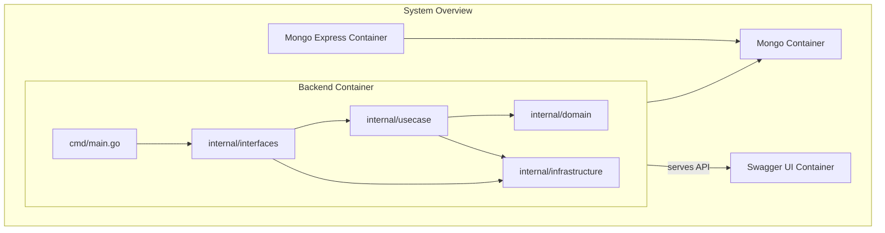

# BridgeMe - Backend

## プロジェクト概要
このプロジェクトは、NFCキーホルダーをスマートフォンにかざすだけで、プロフィールをウェブブラウザに表示するシンプルなサービスです。バックエンドはGo言語で実装されており、クリーンアーキテクチャの原則に従っています。

## 開発環境のセットアップ

### 前提条件
- Docker
- Docker Compose

### 環境構築手順

1.  **リポジトリのクローン**
    ```bash
    git clone https://github.com/StepByCode/BridgeMe.git
    cd BridgeMe-Back
    ```

2.  **.env ファイルの作成**
    プロジェクトのルートディレクトリに `.env` ファイルを作成し、以下の内容を記述してください。
    ```env
    MONGO_DB_ROOT_USERNAME=root
    MONGO_DB_ROOT_PASSWORD=password
    ME_CONFIG_BASICAUTH_USERNAME=admin
    ME_CONFIG_BASICAUTH_PASSWORD=changeme
    ```
    *   `MONGO_DB_ROOT_USERNAME`, `MONGO_DB_ROOT_PASSWORD`: MongoDBの認証情報です。
    *   `ME_CONFIG_BASICAUTH_USERNAME`, `ME_CONFIG_BASICAUTH_PASSWORD`: Mongo Expressの管理画面にログインするための認証情報です。`changeme` は任意のパスワードに変更してください。

3.  **Docker Compose の起動**
    以下のコマンドを実行すると、MongoDBとGoバックエンド、Mongo Expressが起動します。
    ```bash
    docker-compose up --build
    ```
    初回起動時やコード変更時には `--build` オプションが必要です。

## アプリケーションの実行

`docker-compose up` コマンドで全てのサービスが起動します。

-   **Goバックエンド:** `http://localhost:8080`
-   **MongoDB:** `localhost:27017` (Dockerコンテナ内部からアクセス)
-   **Mongo Express:** `http://localhost:8081`

## APIドキュメント (OpenAPI / Swagger UI)

Goバックエンドが起動している状態で、以下のURLにアクセスするとAPIドキュメント（Swagger UI）を確認できます。

-   **Swagger UI:** `http://localhost:8082`

## Mongo Express (MongoDB管理画面)

MongoDBが起動している状態で、以下のURLにアクセスするとMongo Expressの管理画面にログインできます。

-   **Mongo Express:** `http://localhost:8081`
    *   **ユーザー名:** `admin`
    *   **パスワード:** `.env` ファイルで設定した `ME_CONFIG_BASICAUTH_PASSWORD` の値（デフォルトは `changeme`）

## APIエンドポイント

| メソッド | パス           | 説明           |
| :------- | :------------- | :------------- |
| `POST`   | `/profiles`    | プロフィールの作成 |
| `GET`    | `/profiles/{id}` | 特定のプロフィールを取得 |
| `GET`    | `/profiles`    | 全てのプロフィールを取得 |

### バリデーションルール
- `POST /profiles`
  - `name`: 必須項目 (required)
  - `affiliation`: 必須項目 (required)
  - `bio`: 必須項目 (required)

## バックエンド構成



